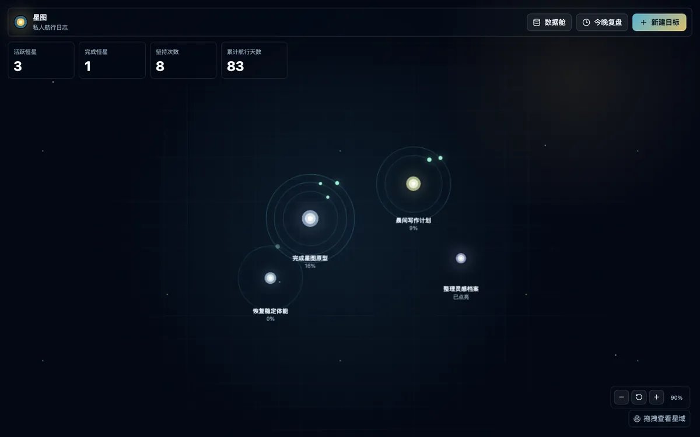
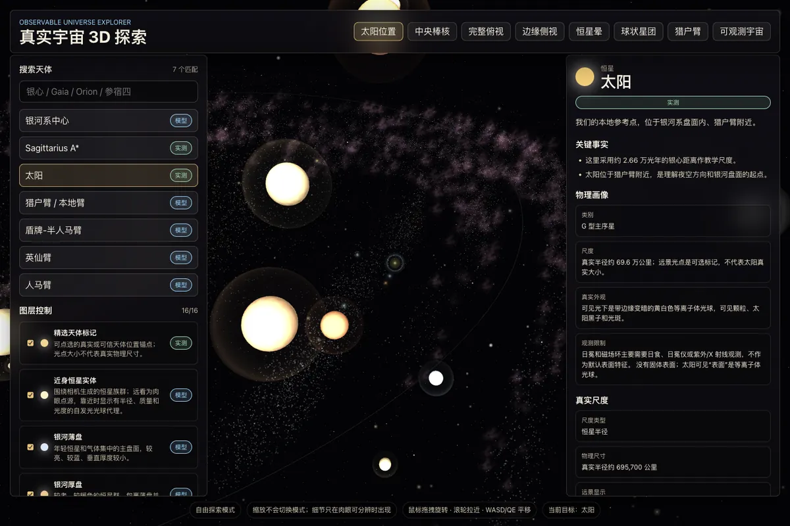
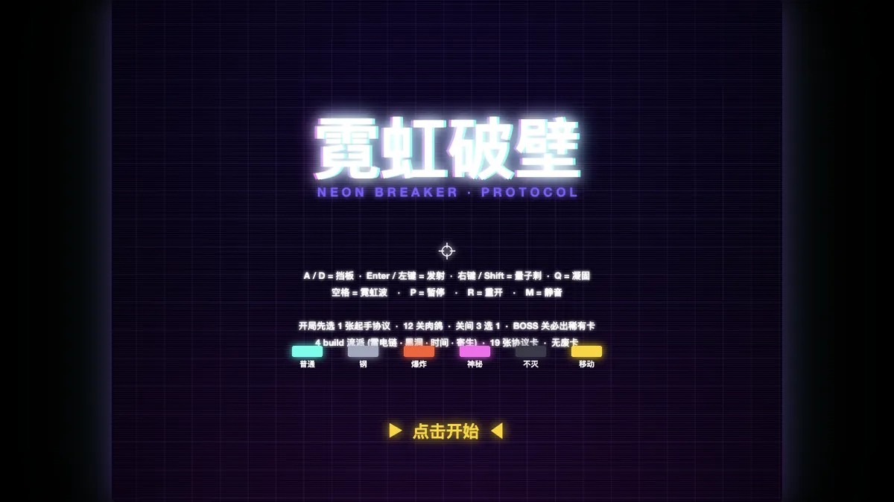
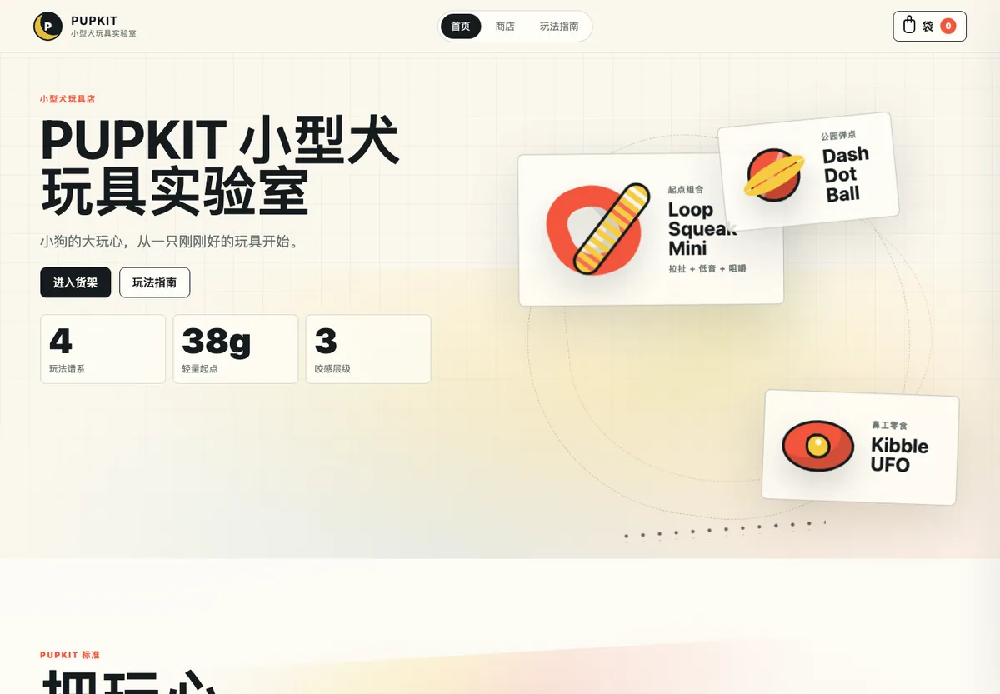

# 空杯

**独立开发者 · 把业务里反复出现的麻烦事，做成能跑、能验证、能交接的工具**

业务自动化 · 数据工具 · 可交互网页作品

---

## 关于我

我在电商业务一线干活：客服知识库、话术生成、数据回流、门店协作。看到反复出现的手工流程，就忍不住把它做成工具——先跑通最小闭环，再持续迭代。

写东西的三条原则：

1. **真实约束优先。** 脏数据、权限边界、人工确认环节，都是设计的一部分，不是障碍。
2. **产出可验证。** 关键操作留痕、有验收记录、能回读断言，结果不靠"应该没问题"。
3. **能交接。** README、截图、发布说明齐全，别人接手不用来问我。

---

## 作品 / Selected Works

四个可以直接点开体验的项目。

### 1 · [星图目标管理 / Xingtu-Targets](https://github.com/dontttbefly-sketch/Xingtu-Targets)

目标不是待办列表里的一行字，而是星图里的一颗恒星：每完成一次 routine，就点亮一段轨道。

- Web / PWA 版本基于 **React + Vite**；macOS 原生版本用 **SwiftUI** 推进中。
- 目标、routine、复盘、进度追踪收敛进同一张可视化星图。
- **[→ 在线体验](https://dontttbefly-sketch.github.io/Xingtu-Targets/)**

### 2 · [真实宇宙 3D 探索 / milky-way-3d-explorer](https://github.com/dontttbefly-sketch/milky-way-3d-explorer)

以真实天文资料为学习锚点的沉浸式宇宙网页：从太阳的位置理解银心距，从旋臂理解星系结构。

- **React + TypeScript + Three.js** 全屏 WebGL 场景，支持拖拽、缩放、搜索与预设视角。
- 16 类图层可切换（银河盘、旋臂、尘埃、星团……），用「实测 / 模型 / 艺术近似」标明每处数据的可信边界。
- **[→ 在线体验](https://dontttbefly-sketch.github.io/milky-way-3d-explorer/)**

### 3 · [霓虹破壁 / brick-breaker](https://github.com/dontttbefly-sketch/brick-breaker)

经典打砖块 × 肉鸽构筑 × 霓虹街机反馈的单文件 HTML 游戏。

- 纯 **Canvas + 原生 JavaScript + Web Audio**，零依赖零构建，打开即玩。
- 12 关流程、BOSS 节点、协议卡构筑，多球 / 激光 / 重击等打法成体系。
- **[→ 在线体验](https://dontttbefly-sketch.github.io/dontttbefly-sketch/brick-breaker/)**

### 4 · [PUPKIT 小型犬玩具实验室 / pupkit-dog-toy-store](https://github.com/dontttbefly-sketch/pupkit-dog-toy-store)

不依赖任何真实商品图片的互动电商独立站概念项目：品牌、商品、玩法全部用 CSS 图形表达。

- 纯静态站点，首页 / 商店 / 玩法指南三页完整，细节动效统一。
- 按玩法气质、身体尺度、购买心情组合筛选；详情抽屉 + 玩具袋完整购物流。
- **[→ 在线体验](https://dontttbefly-sketch.github.io/pupkit-dog-toy-store/)**

---

## 工程与自动化 / Engineering

### [飞书客服差评转发器 / feishu-review-forwarder](https://github.com/dontttbefly-sketch/feishu-review-forwarder)

把飞书群机器人收到的差评告警，按客服账号自动原话私聊转发给对应客服——省掉人工盯群、复制、派发。

- 解析群消息中的客服账号，映射规则由飞书多维表格维护。
- 本地记录每次发送结果，成功 / 失败 / 权限问题可排查。
- 围绕真实运营协作流设计，公开版本已脱敏。

### [Import to Photos / import-to-photos](https://github.com/dontttbefly-sketch/import-to-photos)

纯本地 macOS 小工具：把截图或图片一键导入 iCloud 同步相册，导入后自动标记、避免重复导入。

- 不联网不上传，支持 jpg / heic / png / RAW 等常见格式。
- Finder 右键同步，写入扩展属性标记跳过已导入文件。
- Release DMG 提供 pkg 安装器与卸载脚本，支持 `--dry-run` 预览。

### 智能转化知识库 / tanyu-1111-skill-build `私有仓库`

输入公司特定格式源表，经过多道工序清洗与组织，输出可直接上传的标准知识库。

- Python 脚本做结构化证据包，AI 做语义匹配、去重与风险修复。
- 输出可审计的表格产物、验收记录与 audit.json。
- 真实业务约束强：质量门、来源可追溯、人工确认边界。

---

## 合集 / Archive

轻量实验不再占据主页，快照收敛进两个合集：

- [**Portfolio Labs**](https://github.com/dontttbefly-sketch/portfolio-labs) — 小工具与实验快照（Markdown 转公众号草稿、小说站点爬虫等）。
- [**Codex Lark Skills**](https://github.com/dontttbefly-sketch/codex-lark-skills) — 可复用的 Codex / Lark skill（STAR 周报整理、协作过程教程化、公开发布脱敏检查）。
原独立仓库已归档，可从合集追溯。

---

## 技术栈

---

## 仓库地图

| 仓库 | 类型 | 一句话 |
|---|---|---|
| [dontttbefly-sketch](https://github.com/dontttbefly-sketch/dontttbefly-sketch) | 主页 | 这份 README 与作品集站点 |
| [Xingtu-Targets](https://github.com/dontttbefly-sketch/Xingtu-Targets) | 作品 · 可在线体验 | 星图目标管理 |
| [milky-way-3d-explorer](https://github.com/dontttbefly-sketch/milky-way-3d-explorer) | 作品 · 可在线体验 | 真实宇宙 3D 探索 |
| [brick-breaker](https://github.com/dontttbefly-sketch/brick-breaker) | 作品 · 可在线体验 | 霓虹破壁小游戏 |
| [pupkit-dog-toy-store](https://github.com/dontttbefly-sketch/pupkit-dog-toy-store) | 作品 · 可在线体验 | PUPKIT 互动电商概念站 |
| [feishu-review-forwarder](https://github.com/dontttbefly-sketch/feishu-review-forwarder) | 工具 | 飞书差评自动转发 |
| [import-to-photos](https://github.com/dontttbefly-sketch/import-to-photos) | 工具 | macOS 截图/图片一键导入 iCloud 相册 |
| [portfolio-labs](https://github.com/dontttbefly-sketch/portfolio-labs) | 合集 | 小工具与实验快照 |
| [codex-lark-skills](https://github.com/dontttbefly-sketch/codex-lark-skills) | 合集 | Codex / Lark skill 快照 |
| study | fork | AI agent 学习 |

另有 3 个私有仓库承载业务工作流；历史快照见两个合集仓库。
---

## 小记

这个主页是我的一张作品地图：哪些在做、哪些已归档、下一步往哪走，一目了然。
