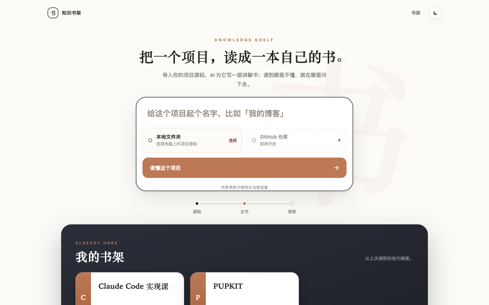
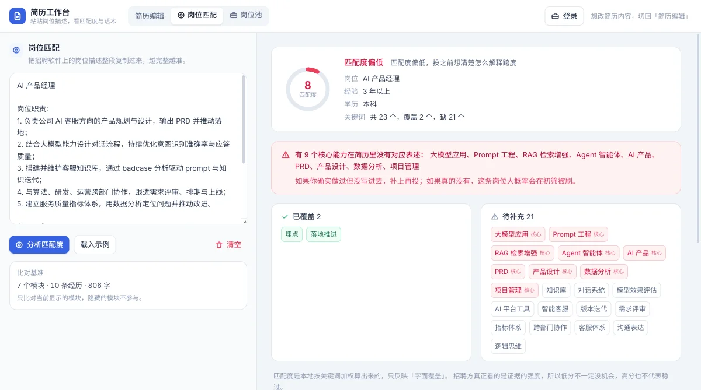

# 空杯

**独立开发者 · 把业务里反复出现的麻烦事，做成能跑、能验证、能交接的工具**

业务自动化 · 数据工具 · 可交互网页作品

---

## 关于我

我在电商业务一线干活：客服知识库、话术生成、数据回流、门店协作。看到反复出现的手工流程，就忍不住把它做成工具——先跑通最小闭环，再持续迭代。

写东西的三条原则：

1. **真实约束优先。** 脏数据、权限边界、人工确认环节，都是设计的一部分，不是障碍。
2. **产出可验证。** 关键操作留痕、有验收记录、能回读断言，结果不靠"应该没问题"。
3. **能交接。** README、截图、发布说明齐全，别人接手不用来问我。

---

## 作品 / Selected Works

按来源分三组：公司项目、精选项目与练习项目，其中 7 个可以直接在线体验。每个项目的完整介绍见 [作品集站点](https://dontttbefly-sketch.github.io/dontttbefly-sketch/)。

### 公司项目

#### 蓝禾学 · 部门学习平台 / lanhe-learn `私有仓库`

新人培训平台：每门课 = 视频 + 思维导图 + PPT，新人每天解锁一关。内容和代码分离，加一门课只写内容，页面框架不用改。

- **React 19 + TypeScript + Vite**：导图节点绑定视频时间点，导图与 PPT 跟随播放；首次观看不能快进，覆盖 95% 才算完成。
- 内容流水线：烧录字幕离线 OCR 自动对齐章节，PPT 截图不可还原打码 + WebP 转码，中文字体按需子集化。
- Vitest 校验内容一致性；进度存储走接口，本机存储可平滑换成云端。

#### 智能转化知识库 / tanyu-1111-skill-build `私有仓库`

输入公司特定格式源表，经过多道工序清洗与组织，输出可直接上传的标准知识库：原本约 1000 工时的整理工作压到 16 工时。

- Python 脚本做结构化证据包，AI 做语义匹配、去重与风险修复。
- 输出可审计的表格产物、验收记录与 audit.json，并同步回飞书表格。
- 真实业务约束强：质量门、来源可追溯、人工确认边界。

#### [飞书客服差评转发器 / feishu-review-forwarder](https://github.com/dontttbefly-sketch/feishu-review-forwarder)

把飞书群机器人收到的差评告警，按客服账号自动原话私聊转发给对应客服：客服查看一条差评从 3 分钟缩短到 5 秒。

- 解析群消息中的客服账号，映射规则由飞书多维表格维护。
- 本地记录每次发送结果，成功 / 失败 / 权限问题可排查。
- 围绕真实运营协作流设计，公开版本已脱敏。

#### [淘宝直播 AI 巡检系统 / taobao-live-inspector](https://github.com/dontttbefly-sketch/taobao-live-inspector)

全天候自动监测主播直播：自动录制 → 语音转写 → 高亮切片 → 主播话术库 → 复盘报告，组长打开报告就能复盘。上线后直播极限词减少 80%，整体转化率提升。

- **Python** 流水线；单直播间多主播轮播时按排班自动归属场次，话术库按主播分开统计。
- 高亮词典按逼单、催付、福利、互动、产品分类，可按业务自定义；极限词单独质检。
- 下播后自动抓取经营数据并写明口径，缺失字段显示「暂无」、不冒充 0；数据不完整时不让 AI 推断因果。
- **[→ 在线演示](https://dontttbefly-sketch.github.io/taobao-live-inspector/)**（演示数据为虚构样本）

### 精选项目

#### 1 · [知识书架 / vibe-shelf](https://github.com/dontttbefly-sketch/vibe-shelf)

把一个项目的源码变成"可以学习和继续生长的书架"：AI 把源码快照写成一本教学主书，旁注层划词解释、气泡内追问改写，书底探索把新方向沉淀成探索小书。

- 阅读器叠加原则：旁注、源码抽屉、引用速览全部悬浮在原书之上，不改动原书一个字、一样式；源码抽屉泊位式与正文同屏并读，正文与源码双向锚定跳转。
- Node.js 本地完整版（导入任意项目文件夹即可成书）+ GitHub Pages 静态演示版（AI 接口自动降级，阅读与本地批注可用）。
- **[→ 在线体验](https://dontttbefly-sketch.github.io/vibe-shelf/)**

#### 2 · [简历工作台 / resume-ai](https://github.com/dontttbefly-sketch/resume-ai)

跑在本机的求职工作台：左边填内容、右边实时看 A4 成品，一键导出 PDF；粘贴岗位描述就能看匹配度和差距，并生成可以直接发出去的打招呼话术。

- **React + TypeScript**：最多 3 份简历档案对应不同岗位，导出的 PDF 是可搜索的真文字。
- 岗位池：抓取实习僧岗位，按简历自动算匹配度排序，投递留给人工。
- 数据只存在本机浏览器，可选 Supabase 云同步。
- **[→ 在线体验](https://dontttbefly-sketch.github.io/resume-ai/)**

#### 3 · [Import to Photos / import-to-photos](https://github.com/dontttbefly-sketch/import-to-photos)

纯本地 macOS 小工具：把截图或图片一键导入 iCloud 同步相册，导入后自动标记、避免重复导入。

- 不联网不上传，支持 jpg / heic / png / RAW 等常见格式。
- Finder 右键同步，写入扩展属性标记跳过已导入文件。
- Release DMG 提供 pkg 安装器与卸载脚本，支持 `--dry-run` 预览。
- **[→ 下载安装](https://github.com/dontttbefly-sketch/import-to-photos/releases)**

#### 4 · [Unizen · 个人项目驾驶舱 / unizen](https://github.com/dontttbefly-sketch/unizen)

本地优先的 macOS 原生应用，用来长期运营个人项目：每个项目是一本「项目书」，未完成的事项留在项目里持续推进，完成的工作沉淀为可追溯的进展历史。解决的是「一个项目做了半年，我还能立刻看懂它、接得上、写得回」。

- **Swift 6** 原生开发，数据只存在本机。
- AI 协作协议：AI 通过访谈生成本地暂存的提纲，用户逐项确认才写入正式的「项目 → 目标 → 事项」，AI 永远不能直接写正式数据。
- 用架构决策记录（ADR）约束性能与写入边界，核心模块有单元测试覆盖。

### 练习项目

 
 

- **[星图目标管理](https://github.com/dontttbefly-sketch/Xingtu-Targets)**：把目标画成星图，每完成一次 routine 就点亮一段轨道。React + Vite 的 Web / PWA 版，macOS 原生版用 SwiftUI 推进中。[→ 在线体验](https://dontttbefly-sketch.github.io/Xingtu-Targets/)
- **[真实宇宙 3D 探索](https://github.com/dontttbefly-sketch/milky-way-3d-explorer)**：React + TypeScript + Three.js 的银河系学习模拟器，16 类图层可切换，用「实测 / 模型 / 艺术近似」标明每处数据的可信边界。[→ 在线体验](https://dontttbefly-sketch.github.io/milky-way-3d-explorer/)
- **[霓虹破壁](https://github.com/dontttbefly-sketch/brick-breaker)**：打砖块 × 肉鸽构筑的单文件 HTML 游戏，纯 Canvas + Web Audio，12 关流程、BOSS 节点与协议卡构筑。[→ 在线体验](https://dontttbefly-sketch.github.io/dontttbefly-sketch/brick-breaker/)
- **[PUPKIT 小型犬玩具实验室](https://github.com/dontttbefly-sketch/pupkit-dog-toy-store)**：不用任何真实商品图、全部用 CSS 图形表达的互动电商独立站，组合筛选、详情抽屉与玩具袋购物流完整。[→ 在线体验](https://dontttbefly-sketch.github.io/pupkit-dog-toy-store/)
- **[小说站点爬虫](https://github.com/dontttbefly-sketch/hetushu-obsidian-scraper)**：用 Playwright 把和图书的小说章节抓取并整理成 Obsidian Markdown 笔记，附中文教学文档。
- **[Markdown 公众号发布器](https://github.com/dontttbefly-sketch/wechat-md-publisher)**：本地 Markdown 一键转成公众号草稿，自动上传封面与正文图片，发布前检查敏感信息；只建草稿，人工确认后再发布。
- **[Codex Lark Skills](https://github.com/dontttbefly-sketch/codex-lark-skills)**：可复用的 Codex / Lark skill 合集，包括 STAR 周报整理、协作过程教程化、公开发布脱敏检查。

---

## 合集 / Archive

早期的轻量实验和 skill 收敛进两个合集，原独立仓库已归档：

- [**Portfolio Labs**](https://github.com/dontttbefly-sketch/portfolio-labs)：早期小工具与实验快照。
- [**Codex Lark Skills**](https://github.com/dontttbefly-sketch/codex-lark-skills)：可复用的 Codex / Lark skill 快照。

`import-to-photos`、`hetushu-obsidian-scraper` 与 `wechat-md-publisher` 已恢复为独立维护。

---

## 技术栈

---

## 仓库地图

| 仓库 | 类型 | 一句话 |
|---|---|---|
| [dontttbefly-sketch](https://github.com/dontttbefly-sketch/dontttbefly-sketch) | 主页 | 这份 README 与作品集站点 |
| [feishu-review-forwarder](https://github.com/dontttbefly-sketch/feishu-review-forwarder) | 公司项目 | 飞书差评自动转发 |
| [taobao-live-inspector](https://github.com/dontttbefly-sketch/taobao-live-inspector) | 公司项目 · 可在线演示 | 淘宝直播 AI 巡检与复盘 |
| [vibe-shelf](https://github.com/dontttbefly-sketch/vibe-shelf) | 精选 · 可在线体验 | 知识书架：把项目源码读成一本书 |
| [resume-ai](https://github.com/dontttbefly-sketch/resume-ai) | 精选 · 可在线体验 | 简历工作台：A4 排版、岗位匹配与打招呼话术 |
| [import-to-photos](https://github.com/dontttbefly-sketch/import-to-photos) | 精选 · 工具 | macOS 截图/图片一键导入 iCloud 相册 |
| [unizen](https://github.com/dontttbefly-sketch/unizen) | 精选 | macOS 个人项目驾驶舱 |
| [Xingtu-Targets](https://github.com/dontttbefly-sketch/Xingtu-Targets) | 练习 · 可在线体验 | 星图目标管理 |
| [milky-way-3d-explorer](https://github.com/dontttbefly-sketch/milky-way-3d-explorer) | 练习 · 可在线体验 | 真实宇宙 3D 探索 |
| [brick-breaker](https://github.com/dontttbefly-sketch/brick-breaker) | 练习 · 可在线体验 | 霓虹破壁小游戏 |
| [pupkit-dog-toy-store](https://github.com/dontttbefly-sketch/pupkit-dog-toy-store) | 练习 · 可在线体验 | PUPKIT 互动电商概念站 |
| [hetushu-obsidian-scraper](https://github.com/dontttbefly-sketch/hetushu-obsidian-scraper) | 练习 · 工具 | 和图书章节抓取整理为 Obsidian 笔记 |
| [wechat-md-publisher](https://github.com/dontttbefly-sketch/wechat-md-publisher) | 练习 · 工具 | 本地 Markdown 转公众号草稿 |
| [portfolio-labs](https://github.com/dontttbefly-sketch/portfolio-labs) | 合集 | 小工具与实验快照 |
| [codex-lark-skills](https://github.com/dontttbefly-sketch/codex-lark-skills) | 合集 | Codex / Lark skill 快照 |
| study | fork | AI agent 学习 |

另有 4 个私有仓库承载业务工作流（蓝禾学、智能转化知识库等）；历史快照见两个合集仓库。

---

## 小记

这个主页是我的一张作品地图：哪些在做、哪些已归档、下一步往哪走，一目了然。
